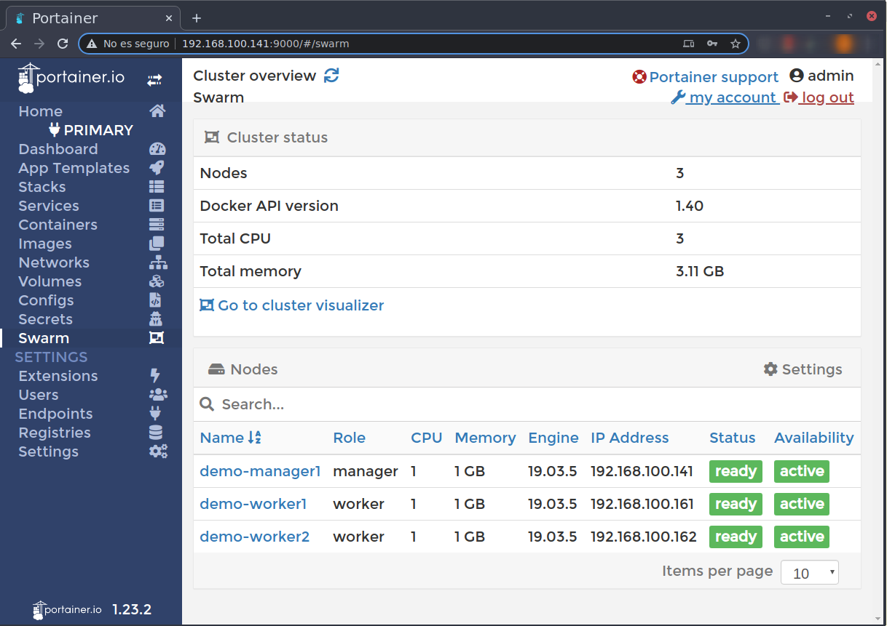

# Create and manage virtual dockder swarm clusters in VirtualBox
[Juan Gutiérrez-Aguado](https://www.uv.es/jgutierr)

- [Preconditions](#org57051b7)
- [Sample usage](#org47d158c)

This script uses `docker-machine` to provision a local virtual cluster in VirtualBox, starts docker swarm in the cluster, and installs the stack Portainer (<http://portainer.io>).

Besides, it creates a set of scripts to manage the created swarm cluster.


<a id="org57051b7"></a>

## Preconditions

Linux host, docker, docker-machine and docker-machine-ipconfig (<https://github.com/fivestars/docker-machine-ipconfig>) to assign static IP addresses to the virtual machines.


<a id="org47d158c"></a>

## Sample usage

```bash
# Cluster name
cluster="demo"

# Number of manager nodes in the swarm cluster
managers=1

# Number of worker nodes in the swarm cluster
workers=2

# Host only network in VirtualBox to connect the VMs
net="192.168.100.1/24"

# Directory to store generated cluster scripts
export CLUSTER_SCRIPTS_DIR=~/.docker/swarm

# Directory where required scripts can be found:
#
#  create_swarm_cluster.sh
#  docker-machine-ipconfig
BIN=~/bin/swarm
export PATH=$PATH:$BIN

# Memory to assign to manager VMs
export MANAGER_MEMORY=1024

# Memory to assign to worker VMs
export WORKER_MEMORY=1024

# Create the swarm cluster using VirtualBox
create_swarm_cluster $cluster $managers $workers $net

# List clusters
list_clusters

```

When the cluster is created and started, a directory `${CLUSTER_SCRIPTS_DIR}/${cluster}` is created and contains the following scripts to manage the cluster:

-   `stop_cluster.sh` to stop the cluster
-   `start_cluster.sh` to start the cluster
-   `status_cluster.sh` to check the status of the cluster
-   `add_worker.sh` to create and add a new worker node to the cluster
-   `rm_worker.sh` to delete a worker node from the cluster (this deletes the VM)
-   `rm_cluster.sh` to delete the whole cluster (deleting all the VMs)

The following image shows a screenshoot of Portainer deployed in the cluster:


